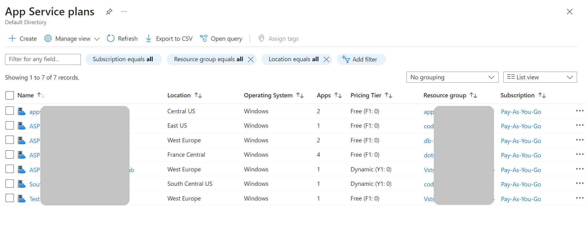

# Azure App Service Plan

An [[azure-app-service]] always runs in an App Service plan, which defines the set of compute resources available to the app.

One or more apps can be configured to run in the same App Service Plan.

Each App Service plan defines:

- Operating System (Windows, Linux)
- Region (West US, East US, etc.)
- Number of VM instances
- Size of VM instances (Small, Medium, Large)
- Pricing tier (Free, Shared, Basic, Standard, Premium, PremiumV2, PremiumV3, Isolated, IsolatedV2)

App Service Plans can be reused and configured as independent entities.

If you publish some applications under the same App Service Plan, when you need to scale the application the same changes are applied to all the other applications within the same App Service Plan. To scale only a single application, you have to move it to a standalone App Service Plan.

You can *potentially* save money by putting multiple apps into one App Service plan. However, since apps in the same App Service plan all share the same compute resources you need to **understand the capacity of the existing App Service plan** and the expected load for the new app.

## Pricing tiers

### Shared compute

- **Free** and **Shared** pricing tiers;
- the app runs on the same Azure VM as other App Service apps (these apps can belong to other customers)
- CPU and computation resources are shared with all the other apps hosted in th same VM;
- resources **cannot scale out**;
- they have a fixed allocated amount of CPU time;

### Dedicated compute

- **Basic**, **Standard**, **Premium**, **PremiumV2**, **PremiumV3** tiers;
- only apps in the same App Service plan share the same compute resources;
- you **can scale out**;
- if multiple apps are in the same App Service plan, they all share the same VM instances.
- if you have multiple deployment slots for an app, all deployment slots also run on the same VM instances.
- if you enable diagnostic logs, perform backups, or run WebJobs, they also use CPU cycles and memory on these VM instances.

### Isolated

Similar to Dedicated compute, but with even more isolation.

- **Isolated** and **IsolatedV2** tiers;
- resources are stored in dedicated VMs and Azure Virtual Networks;
- maximum level of isolation;
- maximum scale-out capabilities;

## How to deploy

- CI/CD
  - Azure DevOps Services
  - GitHub
  - BitBucket
- Manual
  - Git URL as remote repository
  - `az webapp up`, which can also create a new App Service
  - Zip deployment, using `curl`
  - FTP/FTPS

## Deployment slots

**Standard** App Service Plan tier or better.

Used to swap staging and production slots.
