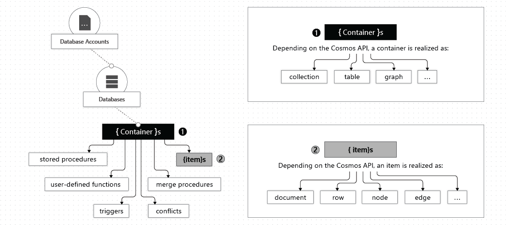

# Azure Cosmos DB

Azure Cosmos DB is a **fully managed NoSQL database** designed to provide low latency, elastic scalability of throughput, well-defined semantics for data consistency, and high availability.

You can configure your databases to be globally distributed and available in any of the [[azure-region]]. To lower the latency, place the data close to where your users are.

It uses **multi-master replication protocol**, meaning that all regions support both reads and writes. Multi-master replication protocol provides some functionalities:

- Unlimited elastic write and read scalability.
- 99.999% read and write availability all around the world.
- Guaranteed reads and writes served in less than 10 milliseconds at the 99th [[percentile]].

However, you can configure it to have only one region enabled for writing.

Your application can perform near **real-time reads and writes against all the regions** you chose for your database. Azure Cosmos DB internally handles the data replication between regions with consistency level guarantees of the level you've selected.

To use CosmoDB you have to create a [[azure-cosmos-db-account]]. Every account can have one or more [[azure-cosmos-db-database]], each containing one or more [[azure-cosmos-db-container]]. Each container then is a collection of [[azure-cosmos-db-item]].

For each account you can define its [[azure-cosmos-db-consistency-levels]].

With Azure Cosmos DB, you pay for the throughput you provision and the storage you consume on an hourly basis. Throughput must be provisioned to ensure that sufficient system resources are available for your Azure Cosmos database always. DB operations are expressed in [[azure-cosmos-db-request-units]].

Azure Cosmos DB encryption protects your data at rest by seamlessly encrypting your data as it's written in our datacenters, and automatically decrypting it for you as you access it.

## Stored procedures, Triggers, User-defined functions

With Azure Cosmos DB you can use **Stored Procedures, Triggers, and User-Defined Functions**. To call a stored procedure, trigger, or user-defined function, you need to register it.

See [[azure-cosmos-db-stored-procedures]], [[azure-cosmos-db-triggers]], and [[azure-cosmos-db-user-defined-functions]].

## Backup

You can define backup policies for your data.

- **Periodic**: backup is taked at periodic intervals, based on configuration.
- **Continuous**: provides a backup window of 7 or 30 days. You can restore data available at any moment in that specific time window.

Backup can be stored redundantly, using either Local-redundant storage or Geo-redundant storage.

## Available APIs

- **NoSQL**: data is stored in document format. **It's the default API**. It supports querying using SQL syntax.
- **MongoDB**: data is stored in documents using BSON format.
- **PostgreSQL**: allows for distributed tables. Data is stored either on a single node or in a multi-node configuration.
- **[[apache-cassandra]]**: data is stored in a **column-oriented schema**. Good for large volumes of data.
- **Apache Gremlin**: creates graphs where data is stored as edges and vertices.
- **Table**: it stores data in **key/value format**. If you're currently using Azure Table storage, you may see some limitations in latency, scaling, throughput, global distribution, index management, low query performance. API for Table overcomes these limitations and it's recommended to migrate your app if you want to use the benefits of Azure Cosmos DB. API for Table only supports [[OLTP]] scenarios.

## Partitions

You have to define partitions to spread the content to all the instances.

You can create logical partition (defined in each item). Azure automatically creates physical partitions, and each physical partition can contain one or more logical partitions.

[[cosmosdb partitions]]

When your system is heavy read, you should define as a partition key one of the field used the most when defining queries.

[[syntetic partition key]]
