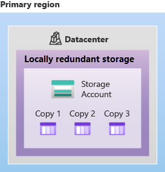
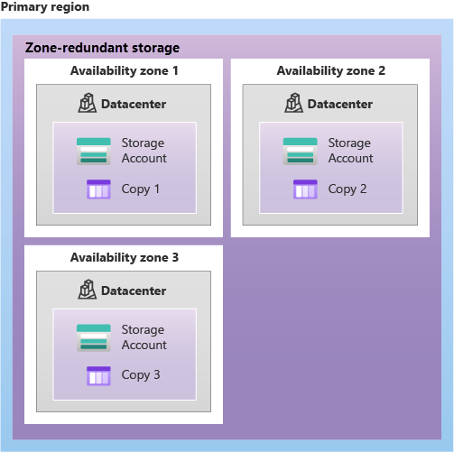
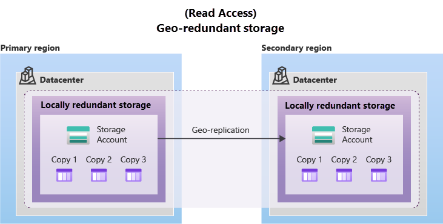
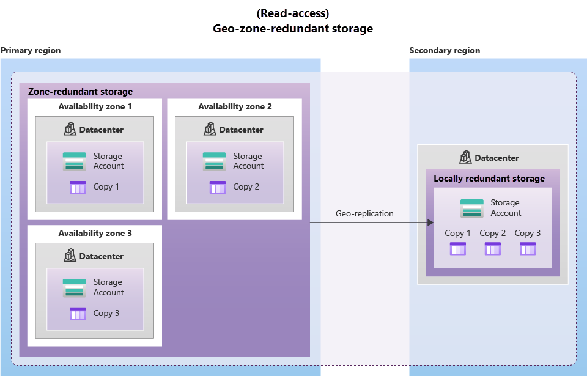

# Azure Storage Redundancy Types

Azure Storage always stores **multiple copies of your data** to protect it from planned and unplanned events.

When deciding the best redundancy option for a specific scenario, you must consider costs and availability.

Data in an Azure Storage account is **always replicated three times** in the primary region.

## Primary zone redundancy

The cheapest options allow you to make data redundant in the same region.

You then have only the primary region.

### Locally Redundant Storage (LRS)

LRS replicates your data three times **within a single data center in the primary region**.

LRS provides at least **11 nines of durability** (99.999999999%) of objects over a given year.

It's the cheapest option and also the one with the least durability.

Suppose a disaster such as fire or flooding occurs within the data center. In that case, all replicas of a storage account using LRS may be lost or unrecoverable.

### Zone-Redundant Storage (ZRS)

ZRS replicates your Azure Storage data **synchronously** across **three [[azure-availability-zones|Azure availability zones]] in the primary region**.

ZRS provides at least **12 nines of durability** (99.9999999999%).

Data is still accessible for **both read and write operations** even if a zone becomes unavailable.

If a zone becomes unavailable, Azure undertakes networking updates, such as DNS repointing.

Good usage of ZRS:

- high availability;
- meet governance requirements to have data replicated only within a region or country.

## Redundancy in a secondary region

If you need even more durability and data availability, you can replicate your data across a secondary region.

When creating a storage account, you must select the primary region. The paired secondary region is assigned automatically, based on [[azure-region-pairs]], and cannot be changed.

By default, **data in the secondary region is only available for read or write access if there's a failover to the secondary region**. If the primary region becomes unavailable, you can choose to fail over to the secondary region. After the failover has been completed, the secondary region becomes the primary region, and you can again read and write data.

**Data is replicated to the secondary region asynchronously**. A failure that affects the primary region may result in data loss if the primary region can't be recovered. The interval between the last write to the primary region and the last write to the secondary region is called **Recovery Point Objective (RPO)**, and it's generally less than 15 minutes.

### Geo-Redundant Storage (GRS)

GRS copies data **synchronously** three times using LRS (so, a single location within the primary region) and then replicates the data **asynchronously** to a single location within the secondary region.

GRS provides at least **16 nines of durability** of objects over a given year.

You cannot read data from the secondary region unless a failover operation is performed.

### Geo-Zone-Redundant Storage (GZRS)

GZRS copies data in 3 different availability zones and then replicates data to a secondary region using LRS.

GZRS provides at least **16 nines of durability** of objects over a given year.

You cannot read data from the secondary region, unless a failover operation is performed.

### Read-Access Geo-Redundant Storage (RA-GRS)

Similar to GRS, but you can also read data from the secondary region.

Data might not be immediately updated due to RPO.

### Read-Access Geo-Zone-Redundant Storage (RA-GZRS)

Similar to GZRS, but you can also read data from the secondary region.

Data might not be immediately updated due to RPO.

[//begin]: # "Autogenerated link references for markdown compatibility"
[azure-availability-zones|Azure availability zones]: azure-availability-zones.md "Azure Availability Zones"
[azure-region-pairs]: azure-region-pairs.md "Azure Region Pairs"
[//end]: # "Autogenerated link references"
