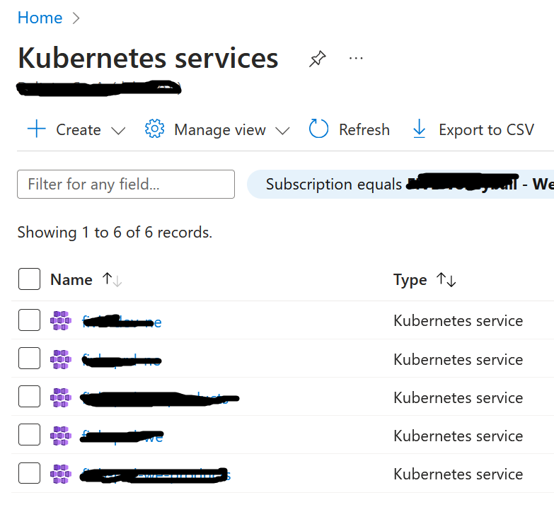
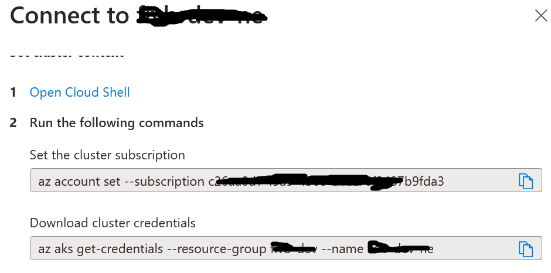

# How to Add Azure K8s Cluster on Lens?

To navigate a K8S Cluster locally, you need a tool, like Lens.

If the cluster is stored on Azure:

## Find the cluster connection info on Azure

First of all, head to [Azure Portal](https://portal.azure.com/), under the _Kubernetes services_ section:

Then, choose the Cluster to import, navigate to _Overview_ > _Connect_

## Store configurations locally

On your local machine, open a Powershell - Powershell, **not** Azure CLI, and run:

1. `az login`
2. `az account set --subscription ........` (see full command on Azure UI - see below)
3. `az aks get-credentials ......` (see full command on Azure UI - see below), using an additional flag `--file` to organize credentials by project. Eg: `az aks get-credentials ..... --flag  C:\Users\davide.bellone\.kube\my-project-config`
4. Navigate to the path specified in the `--file` path to check that the credentials have been stored;
5. Open Lens, and import the configurations.

