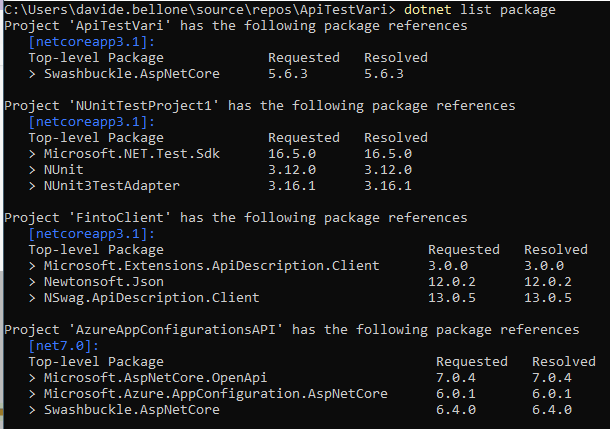
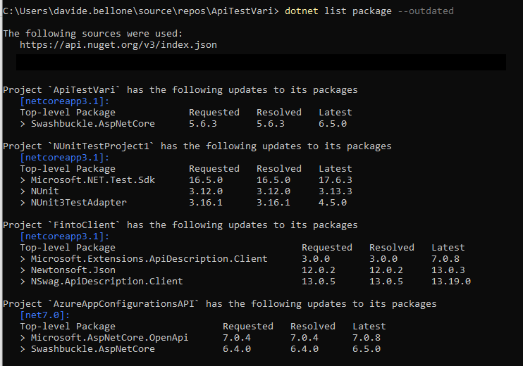

# How to list all the installed NuGet Packages

There is a simple command that can be run to list all the NuGet packages installed in a solution or a project, as well as listing the .NET version used by each project: `dotnet list package`.



The command lists all the first-level dependencies, specifying the requested version and the resolved version.

You can run that command inside the project directory to narrow down the scope of the command.

It has several options:

```plaintext
Options:
  -v, --verbosity <LEVEL>                  Set the MSBuild verbosity level. Allowed values are q[uiet], m[inimal], n[ormal], d[etailed], and
                                           diag[nostic].
  --outdated                               Lists packages that have newer versions. Cannot be combined with '--deprecated' or '--vulnerable' options.
  --deprecated                             Lists packages that have been deprecated. Cannot be combined with '--vulnerable' or '--outdated' options.
  --vulnerable                             Lists packages that have known vulnerabilities. Cannot be combined with '--deprecated' or '--outdated'
                                           options.
  --framework <FRAMEWORK | FRAMEWORK\RID>  Chooses a framework to show its packages. Use the option multiple times for multiple frameworks.
  --include-transitive                     Lists transitive and top-level packages.
  --include-prerelease                     Consider packages with prerelease versions when searching for newer packages. Requires the '--outdated'
                                           option.
  --highest-patch                          Consider only the packages with a matching major and minor version numbers when searching for newer packages.
                                           Requires the '--outdated' option.
  --highest-minor                          Consider only the packages with a matching major version number when searching for newer packages. Requires
                                           the '--outdated' option.
  --config <CONFIG_FILE>                   The path to the NuGet config file to use. Requires the '--outdated', '--deprecated' or '--vulnerable' option.
  --source <SOURCE>                        The NuGet sources to use when searching for newer packages. Requires the '--outdated', '--deprecated' or
                                           '--vulnerable' option.
  --interactive                            Allows the command to stop and wait for user input or action (for example to complete authentication).
  --format <console|json>                  Specifies the output format type for the list packages command.
  --output-version <output-version>        Specifies the version of machine-readable output. Requires the '--format json' option.
```

## Outdated packages

One of the most important ones is `--outdated`: it lists the packages that have updates not yet installed on the project.



The command also lists the latest version of each package.

## Vulnerable packages

Another one is `--vulnerable`: it lists the packages flagged as vulnerable, as well as the severity of the vulnerability.


